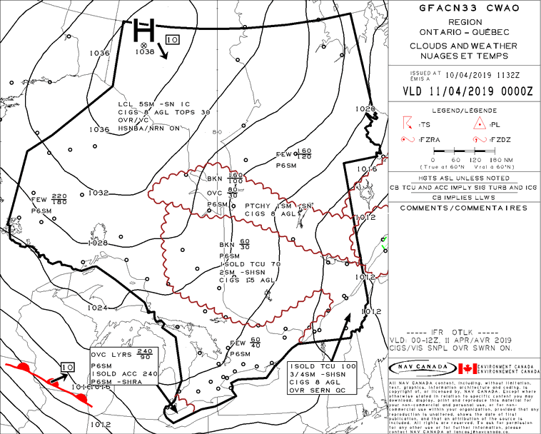

# TAF Decoding

Meteorology

* Aviation Forecasts
  * Aerodrome Forecasts (TAF)

## Background

Terminal aerodrome forecasts (TAFs) are an excellent source of forecase for weather information relevant to
aerodrome operations (e.g., takeoff/landing cross winds and height and coverage of the clouds).  They use much
the same format as METARs with just some additional abbreviations to specify the time lines and changes.

Here is the Ontario graphic forecast area (GFA) for April 11 00:00Z. You can see there is a warm front (the red
line with the bumps on it) moving in on the bottom left. This makes for misserable weather in Windsor.



## Exercise

Complete the decoding of this TAF

```
TAF AMD CYQG 101412Z 1014/1112 03010G20KT P6SM OVC020 TEMPO
1014/1017 OVC025 FM101700 03012G22KT P6SM BKN025 BKN250
FM102200 04015KT P6SM OVC120 FM110100 04015KT P6SM -RA FEW030
OVC080 FM110300 05012KT 6SM -SNRA BR OVC050 FM110700 06015KT
P6SM -RA OVC050 PROB30 1107/1111 6SM -RAPL BR FM111100
08015G25KT P6SM SCT050 BKN080 RMK FCST BASED ON AUTO OBS. NXT
FCST BY 101800Z=
```

Type:
 ~ Amended TAF

Location:
 ~ CYQG (Windsor)

Date:
 ~ April ??

Time:
 ~ ??

Period
 ~ April 10 14:00Z to April 11 12:00Z

Initial base conditions
```
03010G20KT P6SM OVC020
```

Wind
 ~ ?? degrees true, 10kt gusting to 20kt

Visibility
 ~ ??

Clouds
 ~ ?? at ?? ft

Temporary changes (reverts back afterwards)
```
TEMPO 1014/1017 OVC025
```

Period
 ~ April ?? ??:??Z to April ?? ??:??Z

Clouds
 ~ ??

New base conditions (doesn't revert back)
```
FM101700 03012G22KT P6SM BKN025 BKN250
```

From
 ~ April ?? ??:??Z

Wind
 ~ ?? degrees true, ??

Visibility
 ~ plus 6sm (statute miles)

Clouds
 ~ ??

New base conditions (doesn't revert back)
```
FM102200 04015KT P6SM OVC120
```

From
 ~ April ?? ??:??Z

Wind
 ~ ?? degrees true, ??

Visibility
 ~ ??

Clouds
 ~ overcast at 12,000ft

New base conditions
```
FM110100 04015KT P6SM -RA FEW030 OVC080
```

From
 ~ April 11 01:00Z

Wind
 ~ 040 degrees true, 15kt

Weather
 ~ ??

Clouds
 ~ few at 300ft, overcast at 800ft

New base conditions
```
FM110300 05012KT 6SM -SNRA BR OVC050
```

From
 ~ April ?? ??:??Z

Wind
 ~ ?? degrees true, 12kt

Visibility
 ~ ??

Weather
 ~ ??

Clouds
 ~ overcast at 500ft

New base conditions
```
FM110700 06015KT P6SM -RA OVC050
```

From
 ~ April ?? ??:??Z

Wind
 ~ ?? degrees true, ??

Visibility
 ~ ??

Weather
 ~ light rain

Clouds
 ~ ??

Variation with 30% probability
```
PROB30 1107/1111 6SM -RAPL BR
```

Period
 ~ April 11 07:00Z to April 11 11:00Z

Visibility
 ~ ??

Clouds
 ~ ??

Weather
 ~ ??

New conditions
```
FM111100 08015G25KT P6SM SCT050 BKN080
```

From
 ~ April ?? ??:??Z

Wind
 ~ ?? degrees true, ??

Visibility
 ~ ??
 
Clouds
 ~ ??


```
RMK FCST BASED ON AUTO OBS. NXT FCST BY 101800Z
```

Remarks
 ~ forecast based on auto observiation, next forecast by April 10 18:00Z

## Reference:

* [aim]: https://www.tc.gc.ca/eng/civilaviation/publications/tp14371-menu-3092.htm
  TC AIM, Chapter MET - Meteorology, Section 4 GFA and Section 8 METARs

  [https://www.tc.gc.ca/eng/civilaviation/publications/tp14371-menu-3092.htm](https://www.tc.gc.ca/eng/civilaviation/publications/tp14371-menu-3092.htm)
